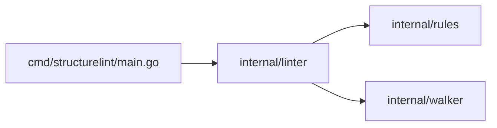

# structurelint for Visual Studio Code

⬆️ **[Parent Directory](../README.md)**

Official VSCode extension for [structurelint](https://github.com/structurelint/structurelint) - architectural linting and structure validation for your codebase.

## Features

- **Real-time Linting**: Automatically lint your workspace on save or file open
- **Problems Panel Integration**: View violations in VSCode's Problems panel
- **Quick Fixes**: Run `--fix` to automatically resolve violations
- **Dependency Graph Export**: Visualize your project's dependency graph in DOT, Mermaid, or JSON format
- **Production Mode**: Analyze only production code (exclude test files)
- **Configurable**: Customize linting behavior via VSCode settings

## Requirements

- VSCode 1.75.0 or higher
- structurelint CLI installed and available in PATH

## Installation

### From VSCode Marketplace (Coming Soon)

1. Open VSCode
2. Press `Ctrl+P` / `Cmd+P`
3. Type `ext install structurelint.structurelint`
4. Press Enter

### From VSIX File

1. Download the latest `.vsix` file from [releases](https://github.com/structurelint/structurelint/releases)
2. Open VSCode
3. Press `Ctrl+Shift+P` / `Cmd+Shift+P`
4. Type "Extensions: Install from VSIX"
5. Select the downloaded `.vsix` file

### Building from Source

```bash
cd vscode-extension
npm install
npm run compile
npm run package
```

This creates a `.vsix` file you can install using the method above.

## Setup

### 1. Install structurelint CLI

The extension requires the structurelint CLI to be installed:

```bash
# Using go install
go install github.com/structurelint/structurelint/cmd/structurelint@latest

# Or build from source
git clone https://github.com/structurelint/structurelint
cd structurelint
go build -o structurelint ./cmd/structurelint
sudo mv structurelint /usr/local/bin/
```

Verify installation:

```bash
structurelint --version
```

### 2. Configure structurelint

Create a `.structurelint.yml` file in your project root:

```yaml
rules:
  no-empty-files: true
  max-depth:
    max: 5
  naming-convention:
    "**/*.go": "snake_case"
```

See [structurelint documentation](../README.md) for full configuration options.

## Usage

### Automatic Linting

The extension automatically lints your workspace when:
- VSCode starts (if enabled)
- You save a file (if `lintOnSave` is enabled)
- You open a file (if `lintOnOpen` is enabled)

Violations appear in the **Problems** panel (`Ctrl+Shift+M` / `Cmd+Shift+M`).

### Manual Commands

Press `Ctrl+Shift+P` / `Cmd+Shift+P` and search for:

- **structurelint: Lint Workspace** - Run linting on entire workspace
- **structurelint: Lint Current File** - Lint the currently open file
- **structurelint: Fix Violations** - Apply automatic fixes
- **structurelint: Export Dependency Graph** - Visualize dependencies

### Status Bar

The status bar shows current linting status:
- `✓ structurelint: No issues` - All checks passed
- `⚠ structurelint: 5 issue(s)` - Violations found
- `⟳ structurelint: Running...` - Linting in progress
- `✗ structurelint: Error` - Error occurred

Click the status bar item to run linting.

## Configuration

Open VSCode settings (`Ctrl+,` / `Cmd+,`) and search for "structurelint":

### `structurelint.enable`
- **Type**: `boolean`
- **Default**: `true`
- **Description**: Enable/disable structurelint linting

### `structurelint.executablePath`
- **Type**: `string`
- **Default**: `"structurelint"`
- **Description**: Path to structurelint executable

If structurelint is not in your PATH, specify the full path:

```json
{
  "structurelint.executablePath": "/usr/local/bin/structurelint"
}
```

### `structurelint.lintOnSave`
- **Type**: `boolean`
- **Default**: `true`
- **Description**: Run structurelint when saving a file

### `structurelint.lintOnOpen`
- **Type**: `boolean`
- **Default**: `true`
- **Description**: Run structurelint when opening a file

### `structurelint.additionalArgs`
- **Type**: `array`
- **Default**: `[]`
- **Description**: Additional command-line arguments for structurelint

Example:
```json
{
  "structurelint.additionalArgs": ["--verbose", "--config", ".custom-config.yml"]
}
```

### `structurelint.productionMode`
- **Type**: `boolean`
- **Default**: `false`
- **Description**: Enable production mode (exclude test files from analysis)

## Example Configuration

Add to your `.vscode/settings.json`:

```json
{
  "structurelint.enable": true,
  "structurelint.lintOnSave": true,
  "structurelint.lintOnOpen": true,
  "structurelint.productionMode": false,
  "structurelint.executablePath": "structurelint",
  "structurelint.additionalArgs": []
}
```

## Features in Detail

### Real-time Linting

The extension runs structurelint in the background and displays violations as you work:


Violations appear with:
- **File path**: Where the violation occurred
- **Message**: Description of the violation
- **Rule**: Which rule was violated (shown in diagnostic code)

### Automatic Fixes

Run automatic fixes for supported rules:

1. Press `Ctrl+Shift+P` / `Cmd+Shift+P`
2. Type "structurelint: Fix Violations"
3. Choose:
   - **Yes** - Apply fixes immediately
   - **Dry Run** - Preview changes without modifying files
   - **Cancel** - Abort

The extension shows which files will be modified before applying fixes.

### Dependency Graph Export

Visualize your project's architecture:

1. Press `Ctrl+Shift+P` / `Cmd+Shift+P`
2. Type "structurelint: Export Dependency Graph"
3. Select format:
   - **mermaid** - For GitHub/GitLab documentation
   - **dot** - For Graphviz rendering
   - **json** - For programmatic access

The graph opens in a new editor tab.

**Mermaid example**:


### Production Mode

Enable production mode to analyze only production code:

```json
{
  "structurelint.productionMode": true
}
```

This excludes test files from:
- Dependency graph analysis
- Dead code detection
- Unused export checking

## Keyboard Shortcuts

No default keybindings are provided. Add your own in `Keybindings` (`Ctrl+K Ctrl+S`):

```json
[
  {
    "key": "ctrl+shift+l",
    "command": "structurelint.lint"
  },
  {
    "key": "ctrl+shift+f",
    "command": "structurelint.fix"
  }
]
```

## Troubleshooting

### "Failed to spawn structurelint"

**Problem**: Extension can't find the structurelint executable.

**Solutions**:
1. Verify structurelint is installed: `structurelint --version`
2. Check if it's in PATH: `which structurelint` (macOS/Linux) or `where structurelint` (Windows)
3. Set full path in settings:
   ```json
   {
     "structurelint.executablePath": "/full/path/to/structurelint"
   }
   ```

### Linting Not Running

**Problem**: No violations appear in Problems panel.

**Solutions**:
1. Check if extension is enabled: `structurelint.enable: true`
2. Verify `.structurelint.yml` exists in workspace root
3. Check Output panel (`View > Output`, select "structurelint") for errors
4. Run manually: `Ctrl+Shift+P` > "structurelint: Lint Workspace"

### No Violations Shown

**Problem**: Extension runs but shows no violations.

**Solutions**:
1. Verify structurelint CLI works: Run `structurelint .` in terminal
2. Check configuration file is valid
3. Enable verbose logging: Add `--verbose` to `additionalArgs`

### Extension Slow

**Problem**: Extension makes VSCode slow.

**Solutions**:
1. Disable `lintOnOpen`: Only lint on save
2. Use `.structurelintignore` to exclude large directories
3. Disable for specific workspaces:
   ```json
   {
     "structurelint.enable": false
   }
   ```

## Development

### Prerequisites

- Node.js 16+
- npm 8+
- VSCode 1.75.0+

### Setup

```bash
cd vscode-extension
npm install
```

### Development Workflow

1. **Open in VSCode**: `code .`
2. **Compile**: Press `Ctrl+Shift+B` or run `npm run compile`
3. **Debug**: Press `F5` to launch Extension Development Host
4. **Test**: Make changes and reload (`Ctrl+R`) in Extension Development Host

### Testing

```bash
npm run lint       # Lint TypeScript code
npm run compile    # Compile TypeScript
```

### Packaging

```bash
npm run package    # Creates structurelint-X.Y.Z.vsix
```

### Publishing

```bash
# First time
vsce login <publisher>

# Publish
npm run publish
```

## Architecture

The extension follows this flow:

```
User Action (save, command)
    ↓
Extension (extension.ts)
    ↓
Spawn structurelint CLI
    ↓
Parse stdout/stderr
    ↓
Update VSCode Diagnostics
    ↓
Display in Problems Panel
```

### Key Files

- **`package.json`**: Extension manifest and configuration
- **`src/extension.ts`**: Main extension logic
- **`tsconfig.json`**: TypeScript compiler configuration

## Contributing

Contributions are welcome! Please see [CONTRIBUTING.md](../CONTRIBUTING.md).

### Areas for Improvement

- [ ] Parse line numbers from violations
- [ ] Add quick fix code actions
- [ ] Multi-root workspace support
- [ ] Configuration schema validation
- [ ] Inline violation decorations
- [ ] Rule-specific severity levels
- [ ] Custom problem matcher

## License

MIT - See [LICENSE](../LICENSE) for details.

## Links

- [structurelint GitHub](https://github.com/structurelint/structurelint)
- [Documentation](../README.md)
- [Issue Tracker](https://github.com/structurelint/structurelint/issues)
- [VSCode Extension Marketplace](https://marketplace.visualstudio.com/items?itemName=structurelint.structurelint) (Coming Soon)

## Changelog

### 0.1.0 (MVP)
- ✨ Initial release
- ✨ Real-time linting integration
- ✨ Problems panel support
- ✨ Automatic fix command
- ✨ Dependency graph export
- ✨ Production mode support
- ✨ Configurable via VSCode settings
